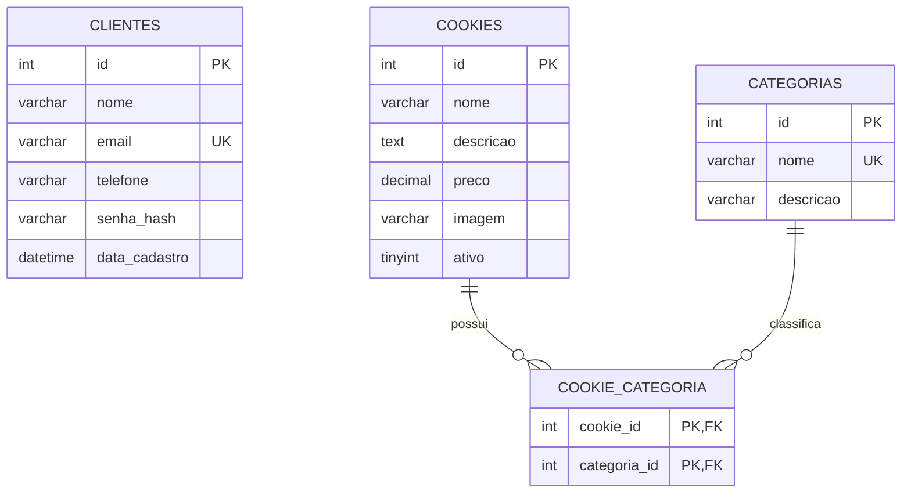

# DER - Dreamy Cookies

## Diagrama Entidade-Relacionamento

## Descrição das Tabelas

| Tabela | Descrição |
|--------|-----------|
| **clientes** | Cadastro de clientes do site |
| **categorias** | Tipos de cookies (Tradicional, Recheado, Especial) |
| **cookies** | Produtos com nome, descrição, preço e foto |
| **cookie_categoria** | Tabela associativa N:N entre cookies e categorias |

## Chaves

- **PK (Primary Key):** `id` em clientes, categorias e cookies; chave composta em cookie_categoria
- **FK (Foreign Key):** `cookie_id` → cookies.id, `categoria_id` → categorias.id
- **UK (Unique Key):** email em clientes, nome em categorias

## Relacionamento N:N

Um cookie pode pertencer a várias categorias (ex.: Brookie = Recheado + Especial).
Uma categoria pode conter vários cookies.

## Cardinalidades

- Clientes: independente (sem FK para outras tabelas neste escopo)
- Cookies ↔ Categorias: **N:N** via `cookie_categoria`
