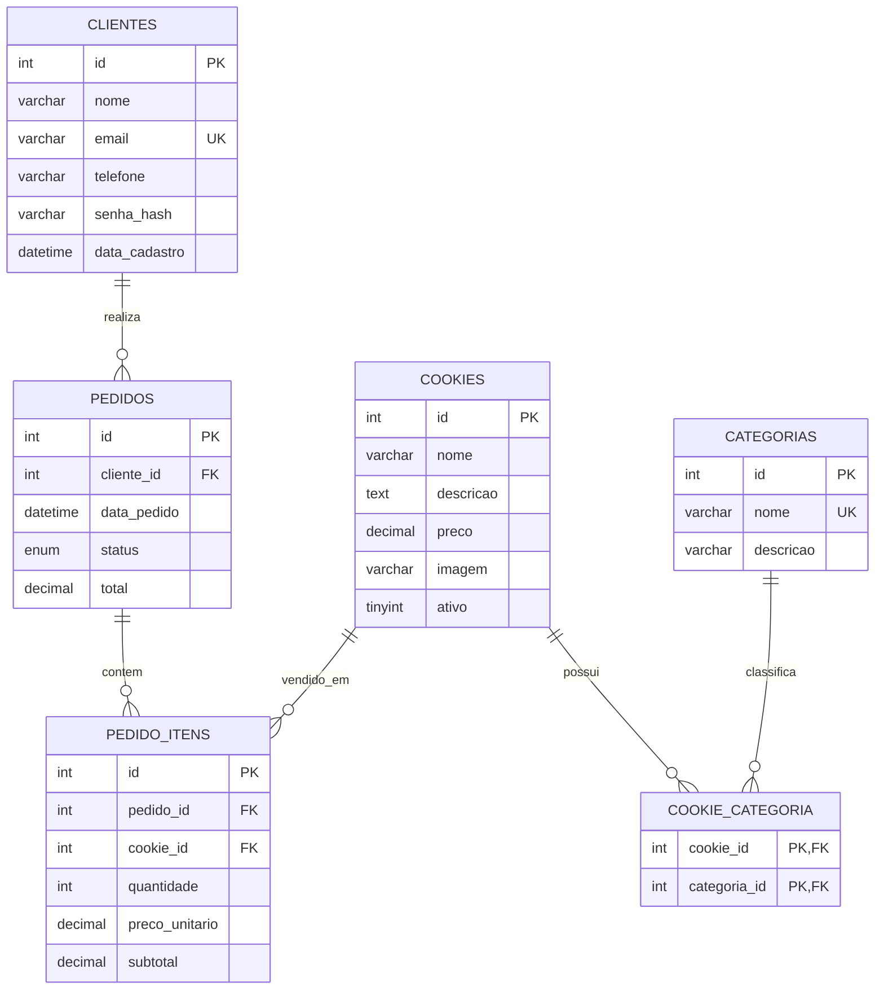

# DER - Dreamy Cookies

## Diagrama Entidade-Relacionamento

## Descrição das Tabelas

| Tabela | Descrição |
|--------|-----------|
| **clientes** | Cadastro de clientes do site |
| **categorias** | Tipos de cookies (Tradicional, Recheado, Especial) |
| **cookies** | Produtos com nome, descrição, preço e foto |
| **cookie_categoria** | Tabela associativa N:N entre cookies e categorias |
| **pedidos** | Pedidos confirmados (dashboard e histórico) |
| **pedido_itens** | Itens de cada pedido (cookie, quantidade, preço) |

## Chaves

- **PK (Primary Key):** `id` nas tabelas principais; chave composta em `cookie_categoria`
- **FK (Foreign Key):** `cookie_categoria`, `pedidos.cliente_id`, `pedido_itens.pedido_id`, `pedido_itens.cookie_id`
- **UK (Unique Key):** `email` em clientes, `nome` em categorias

## Relacionamentos

- **Cookies ↔ Categorias:** N:N via `cookie_categoria`
- **Clientes → Pedidos:** 1:N (cliente pode ter vários pedidos)
- **Pedidos → Pedido_itens:** 1:N (cada pedido tem vários itens)
- **Cookies → Pedido_itens:** 1:N (mesmo cookie em vários pedidos)

## Banco avançado (nova rubrica)

Script: `database/avancado.sql`

| Objeto | Nome | Função |
|--------|------|--------|
| Função | `fn_subtotal_item` | Calcula quantidade × preço |
| Função | `fn_total_pedido` | Soma subtotais de um pedido |
| Trigger | `trg_cookies_preco_positivo_update` | Impede preço negativo em cookies |
| Trigger | `trg_pedido_itens_validar_*` | Valida quantidade/preço e recalcula subtotal |
| View | `vw_cookies_completo` | Cookie + categorias agregadas |
| View | `vw_pedidos_detalhados` | Pedido + cliente + itens |
| View + CTE | `vw_vendas_por_categoria` | Faturamento por categoria |
| View + CTE | `vw_dashboard_resumo` | Indicadores gerais da loja |
| Procedure | `sp_dashboard_indicadores` | Métricas para API/dashboard |
| Procedure | `sp_listar_pedidos` | Filtros, busca e paginação |
